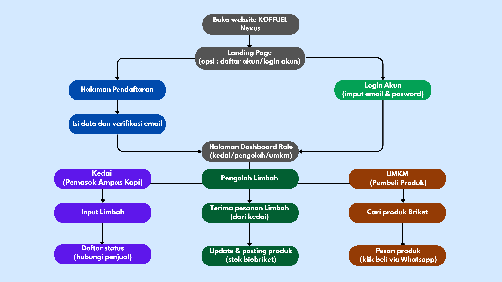

# KOFFUEL Nexus

> Platform digital (WEB) penghubung ekosistem limbah ampas kopi — dari kedai ke pengolah, hingga ke UMKM.

---

## Deskripsi Proyek

**KOFFUEL Nexus** adalah platform web berbasis Laravel yang menghubungkan tiga pihak dalam ekosistem daur ulang ampas kopi:

- **Kedai Kopi** — Pemasok limbah ampas kopi
- **Pengolah Limbah** — Mengolah ampas menjadi biobriket
- **UMKM** — Pembeli produk biobriket hasil olahan

---

## yang Digunakan digunakan

 Backend = PHP (Laravel) 
 Frontend = Blade Template / HTML, CSS, JS 
 Database = MySQL 
 Server Lokal = XAMPP (Apache + MySQL) 
 Package Manager = Composer (PHP), NPM (JS) 

---

## Apa saja yang diperlukan

Sebelum memulai, pastikan anda sudah menginstal:

- [XAMPP](https://www.apachefriends.org/) (versi 8.0 ke atas, sudah termasuk PHP & MySQL)
- [Composer](https://getcomposer.org/) (dependency manager PHP)
- [Node.js & NPM](https://nodejs.org/) (versi 16 ke atas)
- [Git](https://git-scm.com/) (opsional, untuk clone repo)
- Browser modern (Chrome, Firefox, Edge, dll.)

---

## Cara Menjalankan Proyek (Dari Awal)

Ikuti langkah-langkah berikut secara berurutan:

---

### Langkah 1 — Jalankan XAMPP

1. Buka aplikasi **XAMPP Control Panel**
2. Klik tombol **Start** pada modul **Apache**
3. Klik tombol **Start** pada modul **MySQL**
4. Pastikan keduanya berwarna hijau (aktif)

---

### Langkah 2 — Clone atau Letakkan Proyek

**Jika menggunakan Git:**
```bash
git clone https://github.com/agungginanjarf/Koffuel-Nexus-.git
cd Koffuel-Nexus-
```

**Jika manual (tanpa Git):**
- Ekstrak folder proyek
- Pindahkan folder proyek ke direktori:
  ```
  C:\xampp\htdocs\koffuel-nexus
  ```

---

### Langkah 3 — Install Dependensi PHP (Composer)

1.Buka **Terminal / Command Prompt**, lalu masuk ke folder proyek:

```bash
cd C:\kopigreen
```

2.Jalankan perintah berikut untuk menginstal semua package PHP:

```bash
composer install
```

> proses ini mungkin butuh bebarapa waktu.

---

### Langkah 4 — Salin File Environment

Buat file konfigurasi `.env` dari file contoh yang tersedia:

```bash
cp .env.example .env
```
---

### Langkah 5 — Generate Application Key

1.Jalankan perintah berikut untuk membuat kunci enkripsi aplikasi:

```bash
php artisan key:generate
```

> itu akan otomatis tersimpan di file `.env` pada variabel `APP_KEY`.

---

### Langkah 6 — Konfigurasi Database

1. Buka browser, akses **phpMyAdmin**:
   ```
   http://localhost/phpmyadmin
   ```
2. Klik **"New"** di panel kiri
3. Buat database baru dengan nama: `kopigreen`
4. Klik **"Create"**

lalu, buka file `.env` dan sesuaikan pengaturan database:

```env
DB_CONNECTION=mysql
DB_HOST=127.0.0.1
DB_PORT=3306
DB_DATABASE=kopigreen
DB_USERNAME=root
DB_PASSWORD=
```

> biasanya XAMPP menggunakan username `root` dan password kosong.

---

### Langkah 7 — Jalankan Migrasi Database

1.Buat semua tabel yang dibutuhkan di database:

```bash
php artisan migrate
```

2.Jika proyek memiliki data awal, jalankan juga:

```bash
php artisan db:seed
```

Atau keduanya sekaligus:

```bash
php artisan migrate --seed
```

---

### Langkah 8 — Install NPM

Instal semua ini terlebih  dahulu:

```bash
npm install
```

Kemudian jalankan:

```bash
npm run dev
```

> pastikan Perintah `npm run dev` terus berjalan, jika  ingin pakai terminal lagi mka Buka terminal baru.

---

### Langkah 9 — Buat Symbolic Link Storage

Agar file yang diunggah bisa diakses dari browser:

```bash
php artisan storage:link
```

---

### Langkah 10 — Jalankan Server Laravel

```bash
php artisan serve
```

Output yang akan muncul:

```
INFO  Server running on [http://127.0.0.1:8000].
```
> sama seperti sebelumnya perintah ini harus terus berjalan
---

### Langkah 11 — Buka Aplikasi di Browser

Akses aplikasi melalui salah satu URL berikut:

```
http://127.0.0.1:8000
```
> bisa langsung klik saat menjalankan perinta php artisan serve

**WEB KOFFUEL Nexus berhasil dijalankan!**

---

## Alur Penggunaan Aplikasi



---
> daftar akun terleih dahulu jika didatabase pada kolom user masih kosong
> jika  sudah daftar maka data akan masuk ke database
## Role Pengguna
  
Role pengguna bisa dilihat di alur 6
---

## Troubleshooting

**Error: `SQLSTATE[HY000] [1049] Unknown database`**
- Pastikan database `kopigreen` sudah dibuat di phpMyAdmin.

**Error: `php: command not found`**
- Pastikan XAMPP sudah berjalan dan PHP sudah ditambahkan ke PATH sistem.

**Error: `composer: command not found`**
- Instal Composer dari [getcomposer.org](https://getcomposer.org) dan restart terminal.

**Halaman tidak tampil / CSS tidak muncul**
- Pastikan sudah menjalankan `npm run dev` dan `php artisan storage:link`.

**Port 8000 sudah dipakai**
- Jalankan di port lain:
```bash
php artisan serve --port=8080
```
**tampilan tumpang tindih**
- jalankan perintah
```bash
php artisan migrate:fresh
```
> resiko data database hilang untuk di refresh (bisa daftar akun lagi baru login akun)
---

## Struktur Direktori Penting

```
kopigreen/
├── app/
│   ├── Http/
│   │   ├── Controllers/         # Logic controller utama
│   │   │   └── Auth/            # Controller autentikasi
│   │   ├── Middleware/          # Middleware aplikasi
│   │   └── Requests/            # Form request & validasi
│   ├── Livewire/
│   │   ├── Actions/             # Livewire actions
│   │   └── Forms/               # Livewire forms
│   ├── Models/                  # Model Eloquent (database)
│   ├── Providers/               # Service provider
│   └── View/Components/         # Blade components
├── database/
│   ├── migrations/              # Struktur tabel database
│   ├── seeders/                 # Data awal / dummy data
│   └── factories/               # Factory untuk testing
├── resources/
│   ├── css/                     # File CSS
│   ├── js/                      # File JavaScript
│   └── views/
│       ├── auth/                # Halaman login & register
│       ├── components/          # Komponen blade
│       ├── kedai/               # Halaman role Kedai
│       ├── layouts/             # Layout utama
│       ├── livewire/            # Komponen Livewire
│       ├── Pengolah/            # Halaman role Pengolah Limbah
│       ├── profile/             # Halaman profil pengguna
│       └── umkm/                # Halaman role UMKM
├── routes/
│   └── web.php                  # Routing aplikasi
├── storage/                     # File upload & cache
├── public/                      # Aset publik (entry point)
├── bootstrap/                   # Bootstrap aplikasi
├── tests/                       # Unit & feature testing
├── .env                         # Konfigurasi environment
├── composer.json                # Dependensi PHP
├── package.json                 # Dependensi JavaScript
├── vite.config.js               # Konfigurasi Vite
└── README.md
```

---

*sekian dari  kami dan TERIMAKASIH
